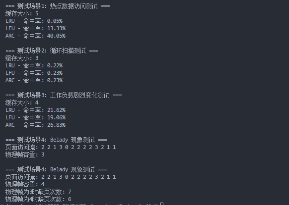
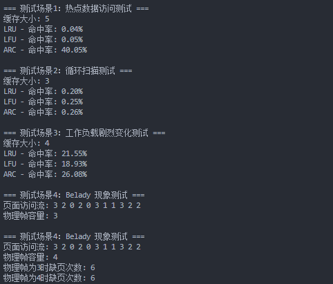
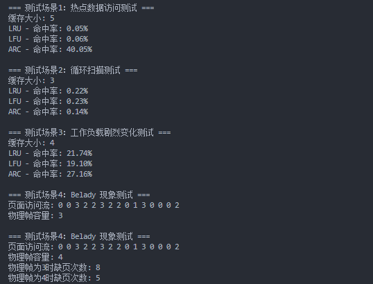

# Cache
原项目：https://github.com/youngyangyang04/KamaCache
提供了LRU，LFU和ARC三种Cache的基本实现，具体思路如下文所示……

本项目在此之上增加了如下内容

- Belady现象的测试

## LRU

### LRU-k

LRU-k 基础的LRU算法被访问数据进入缓存队列只需要访问(`put、get`)一次就行，但是现在需要被访问k（大小自定义）次才能被放入缓存中，基础的LRU算法可以看成是LRU-1。

LRU-k算法有两个队列一个是缓存队列，一个是数据访问历史队列。当访问一个数据时，首先将其添加进入访问历史队列并进行累加访问次数，当该数据的访问次数超过k次后，才将数据缓存到缓存队列，从而避免缓存队列被冷数据所污染。同时访问历史队列中的数据也不是一直保留的，也是需要按照LRU的规则进行淘汰的。LRU-k执行过程如图：


### Hash-LRU


## LFU

对于不同的访问频率维护了不同的链表，minFreq和maxFreq构成了访问频率的维护区间。

Key和Value之间的映射依然是在`NodeMap`（本质是个哈希表）中维护，每次寻找节点需要遍历这个哈希表。

**恢复计数的LFU实现：增加FreqList本质是为了维护不同访问频率的节点，用来计算平均访问频率`AverageNum`，通过`AverageNum`和最大平均访问频率`MaxAverageNum`比较，当超过`MaxAverageNum`时，减小所有节点的访问频次。**优点是对新加入的节点有利，以及对很久没有访问的热点数据可以及时淘汰……


## ARC

参考实现：[ZFS 文件系统 （ 9 ） -- ARC 可调替换缓存_zfs arc-CSDN博客](https://blog.csdn.net/liuyun2113/article/details/12705057)


## 编译
创建一个build文件夹并进入
```
mkdir build && cd build
```
生成构建文件
```
cmake ..
```
构建项目
```
make
```
如果要清理生成的可执行文件
```
make clean
```

## 运行
```
./main
```

## 测试
不同缓存策略缓存命中率测试对比结果如下：

增加了对Belady现象的测试……






